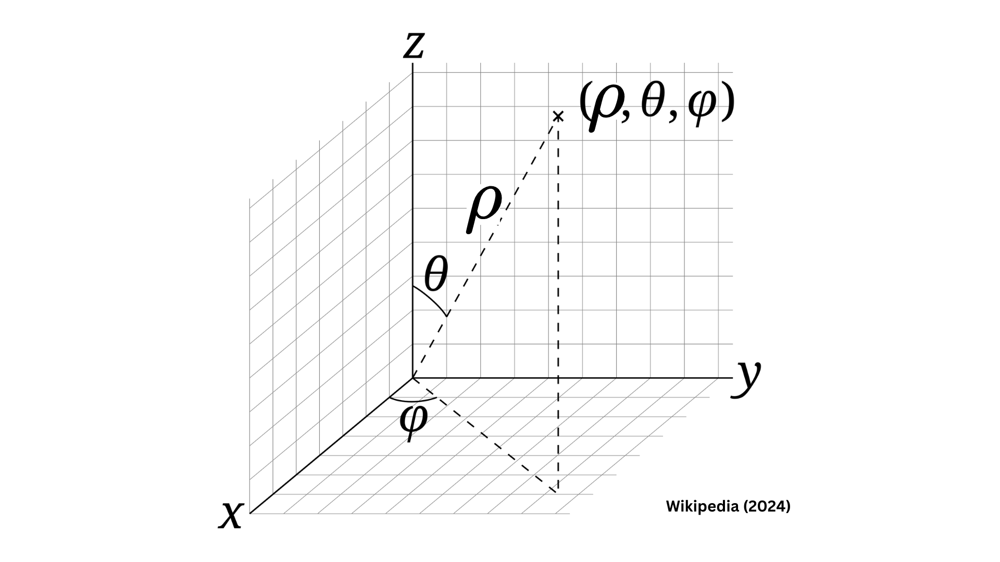

# Get Technical

I intend to discuss the equations and explain essential derivations (or proofs) but for now, I am going to simply dump the relevant equations here. 

### *Equations based on cartesian and cylindrical coordinates*

#### *Diagram for deriving cartesian coordinates*

#### *Superellipse radius*

#### *Superellipse angle based on cylindrical coordinates*

### *Equations based on spherical coordinates*

#### *Diagram for deriving spherical coordinates*

#### *Sphere rho*

#### *Superellipsoid rho*

#### *Superellipsoid rho, featuring expanded exponents*

#### *Sphere x,y,z*

#### *Superellipsoid x,y,z featuring expanded exponents*

#### *Superellipsoid angle Phi based on spherical coordinates*

#### *Superellipse angle Theta based on spherical coordinates*

