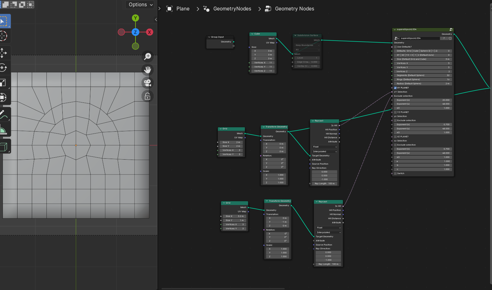

# Grid to Circle
The node group can be used as a utility tool to conform vertices to a superellipse, when one plane is selected. You may also use it for multi-dimensional distortions, but I haven't experimented with that extensively and cannot comment on that application.

Again this documentation is still under development but here are some images illustrating the basic setup for this.

Use the exclusion socket only if you want to exclude some points. You can learn more in the video.